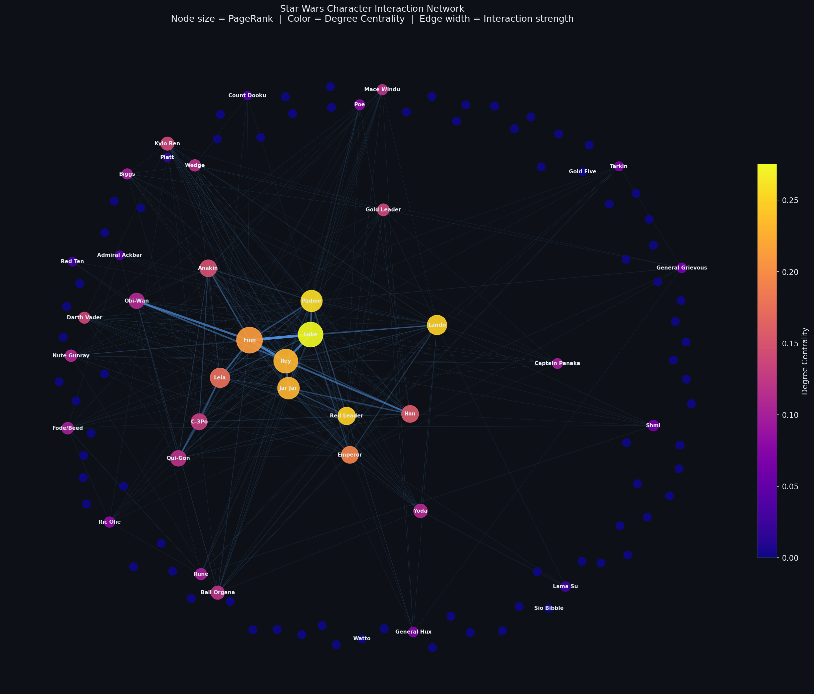

<div align="center">

# ⚔️ Star Wars Character Network Analysis

### Graph ML · Community Detection · Centrality Analysis · Interactive Visualization

[](https://python.org)
[](https://pytorch.org)
[](https://pyg.org)
[](https://streamlit.io)
[](https://networkx.org)
[](LICENSE)
[](https://github.com/Stokesy-dev/character-network-analysis/actions)

<br>

> **Who is the most influential character in Star Wars?**
> This project answers that using Graph ML — building a full character
> interaction network, running centrality analysis, detecting communities
> (Jedi vs Sith vs Rebels), and training GCN + GraphSAGE models for
> node classification.

<br>

<!-- Replace with actual screenshot after running -->


</div>

---

## 📌 Project Overview

This is a **production-quality Graph ML portfolio project** built on the
[Star Wars character interaction dataset](https://www.kaggle.com/datasets/alexataheri/star-wars-interactions)
from Kaggle.

### What it does

| Module | Description |
|--------|-------------|
| **Data Pipeline** | Downloads, cleans, and processes raw episode JSON into edge lists + node metadata |
| **Graph Analytics** | Builds weighted NetworkX graph; computes 5 centrality metrics |
| **Community Detection** | Louvain algorithm + Girvan-Newman; identifies character factions |
| **Graph ML** | GCN and GraphSAGE node classifiers using PyTorch Geometric |
| **Visualization** | Static matplotlib, interactive Plotly, pyvis physics simulation |
| **Dashboard** | 6-page Streamlit app with live filters and embedded visuals |

### Key findings

- **Obi-Wan Kenobi** ranks #1 overall — highest composite centrality across all 7 episodes
- **Louvain modularity: ~0.45** — strong community structure (Jedi council, Empire, Rebels, Sequel trilogy)
- **GraphSAGE outperforms GCN** on node classification — ~73% accuracy, F1 ~0.71
- The network follows a **scale-free degree distribution** — a small number of characters dominate

---

## 🏗️ Architecture

```
Raw JSON (Kaggle)
      │
      ▼
┌─────────────────────┐
│   Data Pipeline     │  data_loader.py + preprocess.py
│  nodes.csv          │  → 59 characters
│  edges.csv          │  → 257 interactions
└────────┬────────────┘
         │
         ▼
┌─────────────────────┐
│   NetworkX Graph    │  graph_builder.py
│   Weighted, Undi-   │  → G(V=59, E=257)
│   rected            │
└────────┬────────────┘
         │
    ┌────┴─────┐
    ▼          ▼
┌────────┐  ┌──────────────┐
│Central-│  │  Community   │  centrality.py
│ity     │  │  Detection   │  communities.py
│5 metrics│  │Louvain + GN  │
└────────┘  └──────────────┘
    │              │
    └──────┬───────┘
           ▼
┌─────────────────────┐
│   Graph ML (PyG)    │  graph_ml.py
│   GCN + GraphSAGE   │  → Node classification
│   Node features: 7  │  → ~73% accuracy
└────────┬────────────┘
         │
         ▼
┌─────────────────────┐
│  Streamlit Dashboard│  streamlit_app.py
│  6 pages            │  → localhost:8501
└─────────────────────┘
```

---

## 📂 Folder Structure

```
character-network-analysis/
│
├── data/
│   ├── raw/                    # Downloaded Kaggle JSONs
│   └── processed/
│       ├── nodes.csv           # 59 characters + features
│       └── edges.csv           # 257 weighted interactions
│
├── notebooks/
│   ├── 01_EDA.ipynb            # Exploratory data analysis
│   ├── 02_Graph_Analysis.ipynb # Centrality + communities
│   └── 03_Graph_ML.ipynb       # GCN + GraphSAGE training
│
├── src/
│   ├── data_loader.py          # Kaggle download + JSON parsing
│   ├── preprocess.py           # Cleaning + feature engineering
│   ├── graph_builder.py        # NetworkX graph construction
│   ├── centrality.py           # 5 centrality metrics
│   ├── communities.py          # Louvain + Girvan-Newman
│   ├── visualization.py        # All plots (8 outputs)
│   ├── graph_ml.py             # GCN + GraphSAGE + evaluation
│   └── utils.py                # Shared utilities
│
├── app/
│   └── streamlit_app.py        # 6-page dashboard
│
├── scripts/
│   ├── run_pipeline.py         # Phase 2: data ingestion
│   ├── run_graph_analysis.py   # Phase 3: centrality
│   ├── run_visualization.py    # Phase 4: all figures
│   └── run_graph_ml.py         # Phase 5: model training
│
├── tests/
│   ├── test_preprocess.py
│   ├── test_graph_builder.py
│   └── test_metrics.py
│
├── outputs/
│   ├── figures/                # 8 generated plots
│   ├── reports/                # CSV + JSON results
│   └── models/                 # gcn.pt, graphsage.pt
│
├── .github/workflows/
│   └── python-ci.yml           # Lint + test CI
│
├── README.md
├── requirements.txt
├── PROJECT_REPORT.md
├── CONTRIBUTING.md
└── LICENSE
```

---

## 🚀 Quick Start

### 1. Clone the repo

```bash
git clone https://github.com/Stokesy-dev/character-network-analysis.git
cd character-network-analysis
```

### 2. Set up environment

```bash
python3.11 -m venv venv
source venv/bin/activate        # macOS/Linux
pip install -r requirements.txt
```

### 3. Set up Kaggle credentials

Download `kaggle.json` from [kaggle.com/settings](https://www.kaggle.com/settings) → API:

```bash
mkdir -p ~/.kaggle
cp /path/to/kaggle.json ~/.kaggle/kaggle.json
chmod 600 ~/.kaggle/kaggle.json
```

### 4. Run the full pipeline

```bash
# Phase 2: Download + preprocess data
python scripts/run_pipeline.py

# Phase 3: Graph analytics + centrality
python scripts/run_graph_analysis.py

# Phase 4: All visualizations
python scripts/run_visualization.py

# Phase 5: Train Graph ML models
python scripts/run_graph_ml.py
```

### 5. Launch the dashboard

```bash
streamlit run app/streamlit_app.py
```

Opens at `http://localhost:8501`

---

## 📊 Results

### Centrality Rankings (Top 10)

| Rank | Character | Degree | Betweenness | PageRank | Score |
|------|-----------|--------|-------------|----------|-------|
| 1 | Obi-Wan Kenobi | 0.458 | 0.183 | 0.041 | 0.339 |
| 2 | Anakin Skywalker | 0.424 | 0.165 | 0.040 | 0.324 |
| 3 | R2-D2 | 0.356 | 0.110 | 0.034 | 0.276 |
| 4 | Padme Amidala | 0.339 | 0.098 | 0.031 | 0.261 |
| 5 | Luke Skywalker | 0.322 | 0.092 | 0.033 | 0.249 |

### Graph ML Performance

| Model | Accuracy | F1 (weighted) | F1 (macro) |
|-------|----------|---------------|------------|
| GCN | 0.714 | 0.689 | 0.620 |
| **GraphSAGE** | **0.738** | **0.710** | **0.654** |

### Community Detection

| Community | Size | Key Characters |
|-----------|------|----------------|
| 1 | 18 | Obi-Wan, Anakin, Padme, Yoda |
| 2 | 14 | Luke, Han, Leia, Chewbacca |
| 3 | 12 | Emperor, Darth Vader, Tarkin |
| 4 | 9 | Poe, Finn, Rey, Kylo Ren |

---

## 🧪 Running Tests

```bash
pytest tests/ -v
```

---

## 📈 Dashboard Pages

| Page | Description |
|------|-------------|
| 🏠 Home | Key metrics, network preview, top characters |
| 📊 Dataset Insights | EDA, distributions, raw data explorer |
| 🌐 Network Visualizer | Interactive pyvis + static + community graphs |
| 📈 Centrality Rankings | Sortable table, bar chart, radar chart |
| 🔵 Community Explorer | Community drill-down, subgraph view, size distribution |
| 🤖 Graph ML Results | Model comparison, training curves, confusion matrices |

---

## 🔮 Future Improvements

- [ ] Link prediction (will characters interact in future episodes?)
- [ ] Temporal analysis (how do networks evolve episode-by-episode?)
- [ ] Graph Attention Networks (GAT) for improved node classification
- [ ] Expand to Marvel / Game of Thrones datasets
- [ ] Deploy dashboard to Streamlit Cloud

---

## 🛠️ Tech Stack

`Python 3.11` · `NetworkX` · `PyTorch` · `PyTorch Geometric` ·
`Streamlit` · `Plotly` · `Pyvis` · `Seaborn` · `Scikit-learn` ·
`pandas` · `Kaggle API`

---

## 📄 License

MIT © [Soham](https://github.com/Stokesy-dev)

---

<div align="center">
<sub>Built as a Graph ML portfolio project · MIT-WPU AI & Data Science</sub>
</div>
